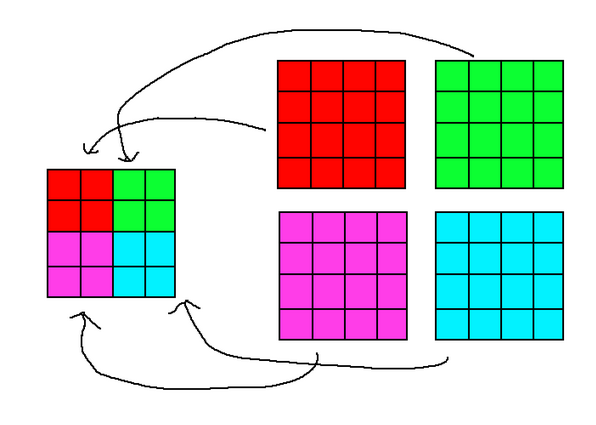

# Voxels

The SpireVoxel library handles meshing, rendering, editing, and serialisation of voxels.

# Procedural Generation

Spire provides an API to support procedural generation.

The VoxelWorld constructor takes in two interfaces: IChunkOrderController and IProceduralGenerationProvider. 

## IChunkOrderController

This interface decides what order chunks should be generated.

### EmptyChunkOrderController

This is a built in controller which never outputs a chunk to be generated.

### SimpleProceduralGenerationController

This is a built in controller which generates chunks in a spiral pattern around the player in columns, this is a similar algorithm to games like Minecraft.

The constructor takes in two parameters:
- viewDistance is the maximum distance in chunks that a chunk should be generated
- yRange is the range of the columns that should be generated (e.g. for (0, 1), only chunks with a y value of 0 or 1 will be generated)

## IProceduralGenerationProvider

This interfaces decides what voxels should be put in the chunk.

You can use the IVoxelEdit API here.

### EmptyProceduralGenerationProvider

This is a built in provider which never sets a voxel in any generated chunk.

### SimpleProceduralGenerationProvider

This is a built in provider which sets the bottom half of every chunk to grass.

### SerializedGenerationProvider

This is a built in Provider useful for world serialisation, documented in the serialisation section.

# Serialisation

Voxel worlds are serialised into a directory of `.sprc` files. `.sprc` (SpireChunk) is a file format specifically for Spire and the spec can be found in SPRC_SPEC.md

Serialisation is fairly simple at the moment, with chunk data just being stored in a binary file with no compression.

Each chunk is stored in a separate file, all chunks are stored in the same directory.

`SpireVoxel::VoxelSerializer` provides functions for loading and saving a world. There are also functions to load and save a single chunk.

## Generation Provider

If you don't want to load an entire world at once you can piggyback on the procedural generation system and use SerializedGenerationProvider.

This class will try and load a chunk from disk when generating a chunk, if the chunk doesn't exist then it will ask a backup provider to generate the chunk.

If you don't want a backup provider, pass in an EmptyProceduralGenerationProvider instance.

# Voxel Edits 

SpireVoxel provides utilities for editing voxels, these are optimised for the renderer and are faster and easier for a game developer to use.

Example:
```
MergedVoxelEdit({
    std::make_unique<CuboidVoxelEdit>(glm::ivec3{0, -32, 0}, glm::uvec3{64, 64, 64}, 1),
    std::make_unique<BasicVoxelEdit>(std::vector{
        BasicVoxelEdit::Edit{{0, 0, 0}, 2}
    })
}).Apply(world);
```

The above example sets the voxels between (0, -32, 0) and ((0, -32, 0) + (64, 64, 64)) to 1 (grass)

It then sets the voxel at (0, 0, 0) to 2 (dirt)

All operations are perfomed at the same time so no unnecessary chunk meshing is performed.

## Custom Voxel Edits

You can add your own voxel edits by implementing the `IVoxelEdit` interface.

## BasicVoxelEdit

Basic edit that changes 1 or more voxels to 1 or more voxel types

## CuboidVoxelEdit

This operation is optimised for how voxel data is stored in chunks. 
The voxel data is contigious along the Z axis. 

This property is used so that multiple voxel types can be written in a single memory write operation.
Note the standard library may split the operation into multiple.

## MergedVoxelEdit

Combines multiple IVoxelEdit into a single edit.

# Rendering

## Main Classes

### Camera

SpireVoxel requires a camera which inherits IVoxelCamera and provides the view projection matrix. 

### Voxel Renderer

`Spire::VoxelRenderer` is the main voxel rendering class which stores pipelines, descriptors, the world, shaders, and more.

You must instantiate this class in your `Application` to render voxels.

### VoxelWorld

`VoxelWorld` wraps the `VoxelWorldRenderer` and all of the chunks in the world, it is intended to be a user-facing API for managing the world providing functionality for editing voxels and loading/unloading chunks.

### VoxelWorldRenderer

This class handles all GPU operations for a world, including maintaining the vertex buffers, voxel data buffers, and chunk data buffers.

### Chunk

This contains all CPU side information for a specific chunk including the type of every voxel in the chunk and a voxel presence bitset to speed up meshing.

It also tracks some GPU information like where the buffers are allocated, the number of vertices in the mesh, etc.

### ChunkMesher

This class handles the meshing order for chunks and uploading meshes to the GPU. It is multithreaded.

### RaycastUtils

This class contains a voxel raycasting utility to determine what voxel, if any, the camera (or any vector) is pointing at.

Internally it uses an implementation of "A Fast Voxel Traversal Algorithm for Ray Tracing", for more information please see https://doi.org/10.2312/egtp.19871000

## Voxel Types

`Spire::VoxelTypeRegistry` contains all registered voxel types and functions for registering new voxel types.

When registering a voxel type, you need to provide:
- A 16 bit unsigned integer id, this is stored both CPU and GPU side to represent the voxel type
- 1 to 6 paths to images 
- A VoxelFaceLayout which determines what images are associated with what faces

### Voxel Images

Each voxel type has 1 to 6 images and a VoxelFaceLayout. When registering a voxel type, all images for all voxel types are stored in a single array of images.

A buffer of GPUVoxelType is stored GPU side to map from the voxel type id to information about the voxel type.

The GPUVoxelType contains the index of the first image 

Example:
```
Textures = ["grass.png", "dirt.png", "grass_side.png",  "dirt.png"] // yes in this case dirt.png is stored twice

GPUVoxelType[0] (air) = null // never queried
GPUVoxelType[1] (grass) = {
    u32 FirstTextureIndex = 0
    u32 VoxelFaceLayout = SPIRE_VOXEL_LAYOUT_TOP_DIFFERENT_BOTTOM_DIFFERENT // top face uses (FirstTextureIndex), bottom face uses (FirstTextureIndex+1), side faces use (FirstTextureIndex+2)
}
GPUVoxelType[2] (dirt) = {
    u32 FirstTextureIndex = 3
    u32 VoxelFaceLayout = SPIRE_VOXEL_LAYOUT_ALL_SAME
}
```

## Chunk Data

Each chunk has an allocation in two BufferAllocators, one to store the vertices (no index buffer used) and another to store the voxel data.

Additionally the world contains a ChunkData buffer for each swapchain image, this is a small (40 bytes) struct which stores some necessary metadata about each chunk.

### Vertex Data

A vertex is made up of 8 bytes, data is compressed using bit masking. Only 38 / 64 bits are used.

- 12 bits (6 width 6 height) are for the width and height of the face, this is required to ensure correct UVs. Could be worked out dynamically https://trello.com/c/uvKgjH4p/85-dont-store-face-sizes-in-vertices
- 21 bits are for storing voxel position (7 bits each axis, with range 0 to 64 inclusive), this could be improved to 18 bits: https://trello.com/c/9KSY7LB0/43-vertex-position-compression
- 2 bits to store vertex position, there is 4 vertices per quad and this identifies which of the 4 vertices it is, used instead of storing UV coordinates
- 3 bits to store face (pos y, pos x, etc), required for VoxelFaceLayout

### Voxel Data

64^3 u16 (voxel type ids) are stored on the GPU for each chunk, there is plans to reduce the size of this data.

To ensure the data is tightly packed on the GPU, 64^3/2 u32 are stored instead and bitmask operations are used to get the u16

### ChunkData

The chunk data buffer is used for indirect drawing, so each chunk data struct contains parameters for indirect drawing (vertex count, instance count, first vertex, first instance)

3 ints are used to store chunk coordinates, e.g. a voxel at 63,0,0 would be in chunk 0,0,0 and a voxel at 64,0,0 would be in chunk 1,0,0

2 ints are used to store where in the voxel data buffer allocator this chunks data is

1 int is used to store what buffer allocator internal buffer the vertex data is (location in that buffer is worked out using a modulo operation, it may be faster to cache this in the chunk data however)

This struct takes up ~0.004% of the VRAM used to store a chunk and is not a target for optimisation.

## Shaders

### ShaderInfo.h

This is a utility file which is valid GLSL and C++ code, it is used by both languages to ensure things like shared struct definitions are identical.

It also contains useful macros like converting from a voxel index to voxel coords

### Vertex Shader

The vertex shaders main job is to extract all the information about the vertex such as its voxel coords, face size, face, etc and pass it along to the fragment shader.

It isn't the most expensive stage.

### Fragment Shader

The fragment shader has two main jobs:
- Figure out the voxel type, this has to be done in the fragment shader because a face can contain multiple voxel types (because of greedy meshing)
- Sample the correct image based on the voxel type and face

## Rendering

Indirect drawing is used to render every chunk in a single draw command.

In the fragment shader, SpireVoxel indexes into ChunkData buffer using gl_InstanceIndex, and ChunkData has information about where to look in the voxel data and vertex buffers.

Vertex pulling is used so a BufferAllocator can be used rather than having a single vertex buffer

# Meshing

Whenever a chunk is loaded or modified, it is marked as requiring remeshing.

Once per frame, a thread pool meshes N chunks and uploads the meshes to new allocations in the buffer allocators.
- N is the number of threads in the CPU

After M frames, the old allocations are marked as unused and future allocations can write to that spot of GPU memory.
- Where M is the number of images in the swapchain

## Greedy Meshing

For more information, see https://liveabertayac-my.sharepoint.com/:w:/r/personal/2202960_uad_ac_uk/_layouts/15/Doc.aspx?sourcedoc=%7B16AA0A29-286F-4D5E-BA49-F91747989F7F%7D&file=v1.11%20-%20Greedy%20Meshing.docx&action=default&mobileredirect=true

Greedy meshing is used to reduce the size of chunk meshes by merging adjacent voxel faces into one face. This increases the time it takes to generate a mesh but is much faster to render and uses less VRAM.

Each slice of each face is meshed separately, this means we iterate 64 (slices per chunk) * 6 (num faces) / 2 (its faster to do positive and negative face in a single pass) times.

Greedy meshing is split into two steps:

### Bit Set Generation

For each slice, an array of 64 u64s (u64 used because chunk size is 64) is created where each u64 represents a column of faces. If a voxel face is present (not air) then the corrosponding bit is set.

If meshing on the CPU (SpireVoxel does) this is the most intensive step.

Example: (assuming chunks are 4x4x4)
```
0 0 0 1
1 1 0 1
1 1 0 1
0 1 1 1
```

### Pushing Faces

Going from left to right, the following algorithm is executed on each column (u64):

- If u64 == 0, skip (all faces in this column are meshed)
- Count the number of trailing zero bits to figure out where the face starts (in the example, 1)
- Shift the u64 right by that number of bits, so the first 1 is at the least significant bit (in this case N >> 1)
- Count the number of trailing one bits to figure out the height of the face
- If there is another column to the right and (this column & next column == this column), then the face can expand into the next column
- Repeat previous step until the condition fails
- Set all bits that are part of the face to 0
- Push 6 vertices to represent the face

See github.com/underscore95/Spire/blob/main/Spire/SpireVoxel/Source/Chunk/Chunk.cpp for implementation.

This is the most intensive step if meshing on the GPU (SpireVoxel doesn't)

### Side Note

Converting from 4D face coordinates to 3D voxel coordinates is possible:

if face is Z axis: (col, row, slice)

else if face is X axis: (slice, row, col)

else if face is Y axis: (col, slice, row) 

# LOD

Spire has a basic LOD system built in. 

It works by squishing n^3 chunks into 1 chunk and rendering that chunk at scale N.



The VoxelWorld doesn't know about LOD, if you want to use LOD you can get the LODManager from VoxelWorld.

Note that this means if you try to get chunk (1,0,0) which isn't loaded but chunk (0,0,0) is LOD 2, chunk (1,0,0) will be rendered but TryGetLoadedChunk would return nullptr.

Chunks with a LOD other than 1 cannot be edited, you would need to load LOD 1 and then edit and then convert back to LOD 2 or higher.

There are only integer LOD levels, LOD 0 is invalid, LOD 1 is full detail, LOD 2 is 1/(2^3) detail

## LODManager

TryGetLODChunk - This will get a chunk from its chunk coordinates if it is loaded, the difference from TryGetLODChunk is that it will return the parent chunk if an LOD chunk is rendering it.

IncreaseLODTo - This will increase a chunks LOD, this will lose unload all chunks that the LOD would cover and the only way to reduce a chunks LOD is to regenerate them as LOD 1 chunks (or load from a file)
