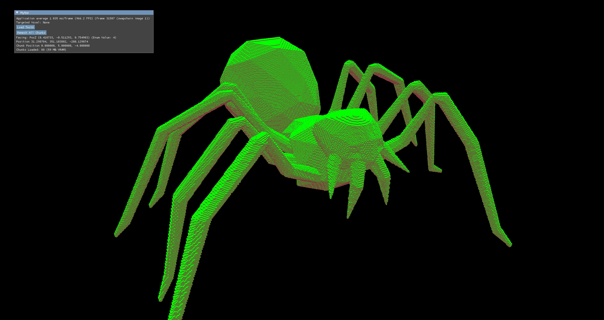

# Spire

Spire is a low level Vulkan voxel renderer.

See [Documentation](https://github.com/underscore95/VulkanTutorial/tree/main/Documentation) for documentation, building instructions,  etc.

Above is a screenshot showing Spire rendering 32x32 Minecraft chunks (36,031,803 non-empty voxels) at over 1600 FPS on an RTX 4060 Ti with 248 MB VRAM.

The entire world can be remeshed and uploaded to the GPU in 150ms on an i7-12700F.

While Spire supports up to 2^32-1 voxel types, only grass and dirt have been configured which is why the world does not look like Minecraft.

Above is a screenshot of a spider model being rendered by Spire. It takes up 8x4x8 chunks where each chunk is 64^3 voxels.

spider.obj was taken from https://github.com/assimp/assimp/tree/master/test/models/OBJ and then converted to .xyzrgb using https://github.com/eisenwave/obj2voxel and then converted into .sprc via Tooling/XYZRGBConverter which Spire is capable of rendering.

46 MB RAM Used

59 MB VRAM Used

0.148ms/frame (6700 FPS)