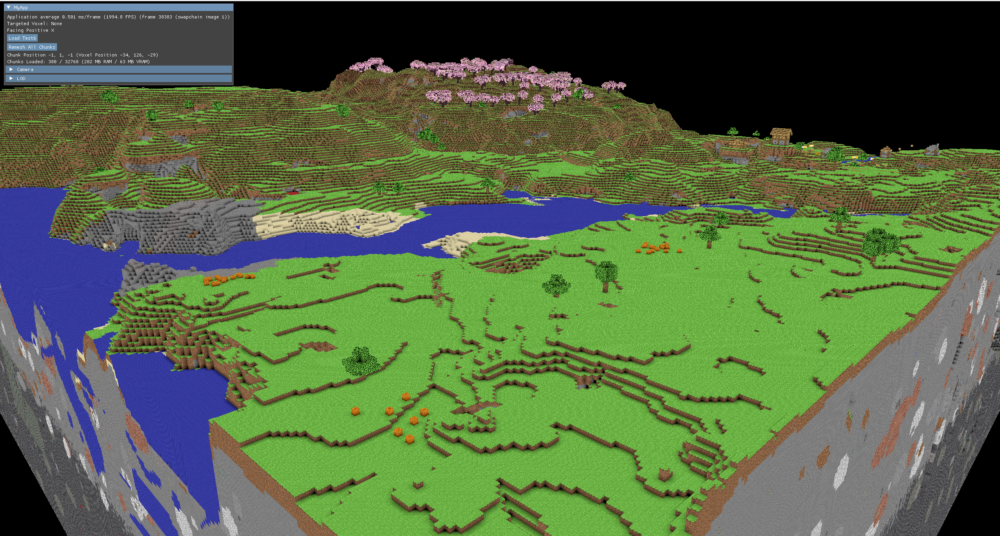
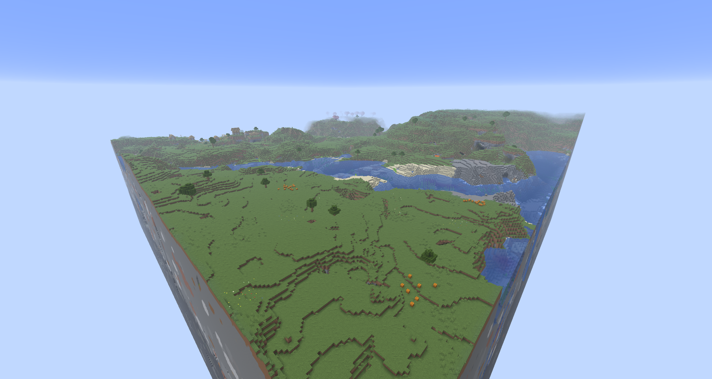
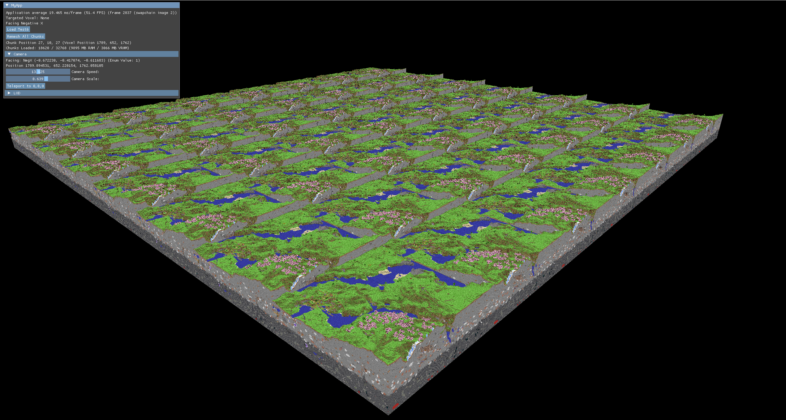
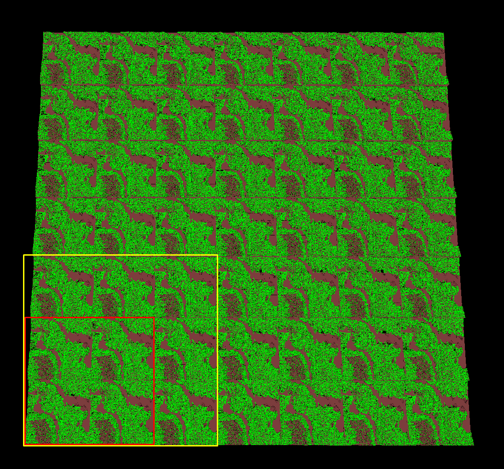
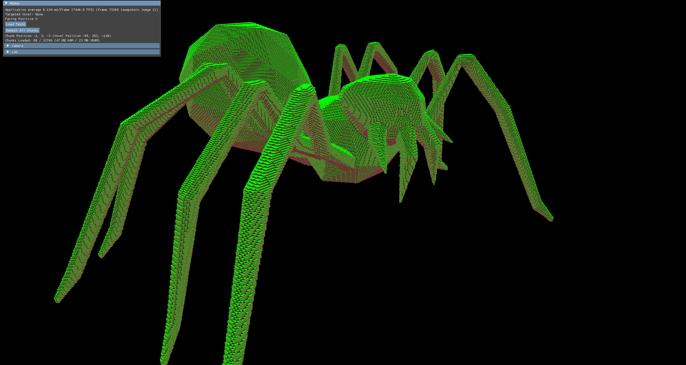

# Spire

Spire is a voxel renderer written in Vulkan using the rasterization pipeline.

See [Documentation](https://github.com/underscore95/VulkanTutorial/tree/main/Documentation) for documentation, building instructions,  etc.

The default GameApplication code relies on Minecraft assets, see [MinecraftRegionConverter README](https://github.com/underscore95/Spire/tree/main/Tooling/MinecraftRegionConverter) for more information.

## Minecraft World

Above is a screenshot showing Spire rendering 32x32 Minecraft chunks (36,031,803 non-empty voxels) at over 9600 FPS on an RTX 4060 TI with 65 MB VRAM.

Minecraft (1.21.1) renders the same world region at 512 FPS with 697 MB RAM and ~0.5GB VRAM. Obviously an unfair comparison because Minecraft has lighting, entities, etc. Minecraft is only utilising 33% GPU.

The entire world can be remeshed and uploaded to the GPU in 180ms (125ms without ambient occlusion) on an i7-12700F (20 threads).

While Spire supports up to 2^16-1 voxel types, only grass and dirt have been configured which is why the world does not look like Minecraft.

Here is how the world looks like in Minecraft: (note that Spire mirrored the world as an artifact of the import process)

## Large World

Spire can render the previous 32x32 Minecraft chunk world 49 times (totalling 1568x1568x384 blocks) at 60 FPS and 4.3 GB VRAM on an RTX 4060 TI in **level 1 LOD** (full detail)

**Note:** The world appears to be repeating because I copy pasted the same 512x384x512 area 48 times (to make a 7x7 square), this is because Spire stores worlds in an uncompressed format for fast reading and otherwise this world would be 9GB.

### Top Down View

Here is a top down view of the previous screenshot.

The red square shows both Hytale and Minecraft's maximum render distance.

The yellow square shows Vintage Story's maximum render distance (note that Vintage Story only has a world height of 256)

Maximum render distance in this context means the largest value that can be set via the in game settings menu without mods. Vintage Story distance was sourced from a player on discord, as I do not own the game.

Note this screenshot is from an outdated Spire version with only 2 voxel types.

## .obj model

Above is a screenshot of a spider model being rendered by Spire. It takes up 8x4x8 chunks where each chunk is 64^3 voxels. 

spider.obj was taken from https://github.com/assimp/assimp/tree/master/test/models/OBJ and then converted to .xyzrgb using https://github.com/eisenwave/obj2voxel (scaled up 4x) and then converted into .sprc via Tooling/XYZRGBConverter which Spire is capable of rendering.

Performance: 
- 46 MB RAM
- 23 MB VRAM
- 6350 FPS
